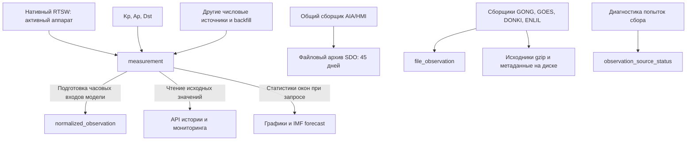

# Потоки данных Clio

```mermaid
flowchart TD
    wind[Нативный RTSW: активный аппарат] --> measurement
    geo[Kp, Ap, Dst] --> measurement
    collectors[Другие числовые источники и backfill] --> measurement
    measurement -->|Подготовка часовых входов модели| normalized_observation
    measurement -->|Чтение исходных значений| api[API истории и мониторинга]
    measurement -->|Статистики окон при запросе| charts[Графики и IMF forecast]
    sdo[Общий сборщик AIA/HMI] --> archive[Файловый архив SDO: 45 дней]
    files[Сборщики GONG, GOES, DONKI, ENLIL] --> file_observation
    files --> originals[Исходники gzip и метаданные на диске]
    monitoring[Диагностика попыток сбора] --> observation_source_status
```
