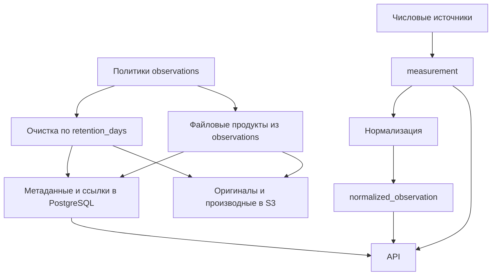

# Потоки данных Clio

```mermaid
flowchart TD
    providers[Числовые источники] --> measurement
    measurement --> normalize[Нормализация] --> normalized_observation
    measurement --> api[API]
    normalized_observation --> api
    files[Файловые продукты из observations] --> s3[Оригиналы и производные в S3]
    files --> metadata[Метаданные и ссылки в PostgreSQL]
    metadata --> api
    policies[Политики observations] --> files
    policies --> cleanup[Очистка по retention_days]
    cleanup --> metadata
    cleanup --> s3
```
