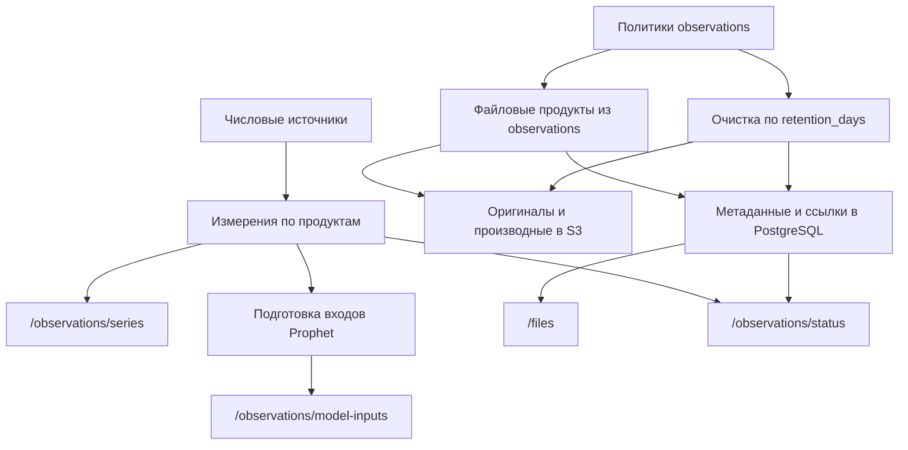

# Потоки данных Clio

```mermaid
flowchart TD
    providers[Числовые источники] --> measurement[Измерения по продуктам]
    measurement --> series["/observations/series"]
    measurement --> normalize[Подготовка входов Prophet]
    normalize --> model["/observations/model-inputs"]
    files[Файловые продукты из observations] --> s3[Оригиналы и производные в S3]
    files --> metadata[Метаданные и ссылки в PostgreSQL]
    metadata --> files_api["/files"]
    measurement --> status["/observations/status"]
    metadata --> status
    policies[Политики observations] --> files
    policies --> cleanup[Очистка по retention_days]
    cleanup --> metadata
    cleanup --> s3
```
