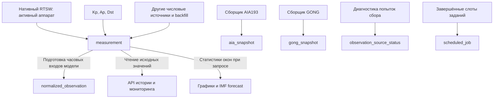

## Data flows

```mermaid
flowchart TD
    wind[Нативный RTSW: активный аппарат] --> measurement
    geo[Kp, Ap, Dst] --> measurement
    collectors[Другие числовые источники и backfill] --> measurement
    measurement -->|Подготовка часовых входов модели| normalized_observation
    measurement -->|Чтение исходных значений| api[API истории и мониторинга]
    measurement -->|Статистики окон при запросе| charts[Графики и IMF forecast]
    aia[Сборщик AIA193] --> aia_snapshot
    gong[Сборщик GONG] --> gong_snapshot
    monitoring[Диагностика попыток сбора] --> observation_source_status
    scheduler[Завершённые слоты заданий] --> scheduled_job
```