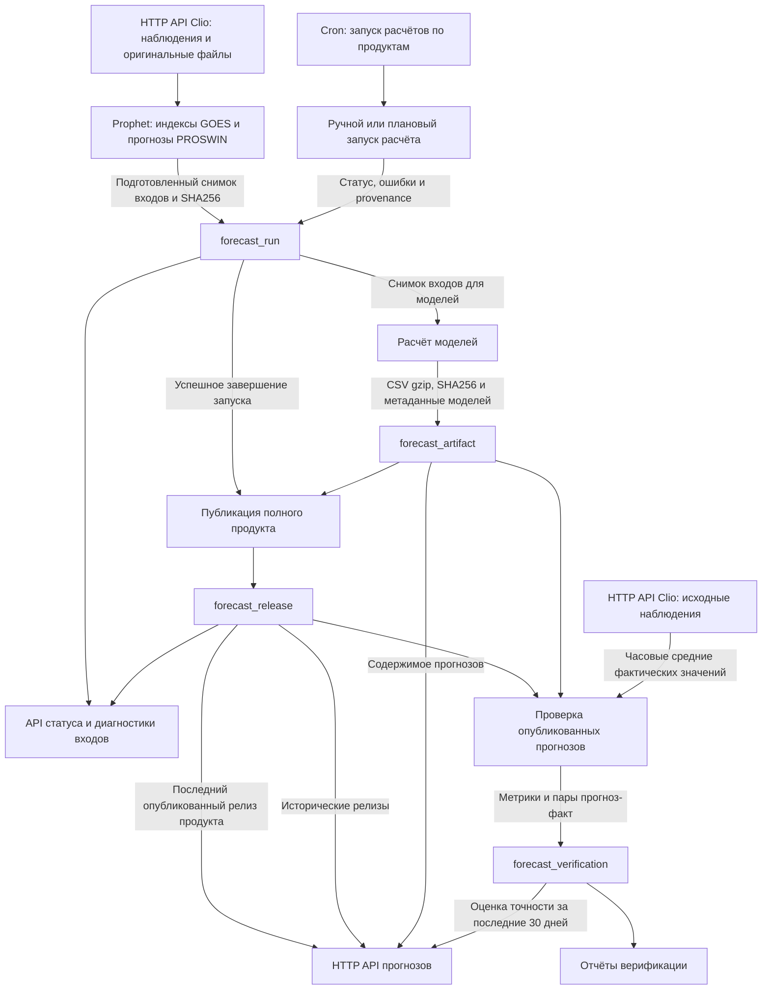

# Потоки данных Prophet

```mermaid
flowchart TD
    clio[HTTP API Clio: наблюдения и оригинальные файлы] --> preparation[Prophet: индексы GOES и прогнозы PROSWIN]
    preparation -->|Подготовленный снимок входов и SHA256| forecast_run
    generation[Ручной или плановый запуск расчёта] -->|Статус, ошибки и provenance| forecast_run
    cron[Cron: запуск расчётов по продуктам] --> generation
    forecast_run -->|Снимок входов для моделей| models[Расчёт моделей]
    models -->|CSV gzip, SHA256 и метаданные моделей| forecast_artifact
    forecast_run -->|Успешное завершение запуска| publication[Публикация полного продукта]
    forecast_artifact --> publication
    publication --> forecast_release
    forecast_release -->|Последний опубликованный релиз продукта| api[HTTP API прогнозов]
    forecast_release -->|Исторические релизы| api
    forecast_artifact -->|Содержимое прогнозов| api
    forecast_run --> status[API статуса и диагностики входов]
    forecast_release --> status
    forecast_release --> verification[Проверка опубликованных прогнозов]
    forecast_artifact --> verification
    observations[HTTP API Clio: исходные наблюдения] -->|Часовые средние фактических значений| verification
    verification -->|Метрики и пары прогноз-факт| forecast_verification
    forecast_verification --> reports[Отчёты верификации]
    forecast_verification -->|Оценка точности за последние 30 дней| api
```
