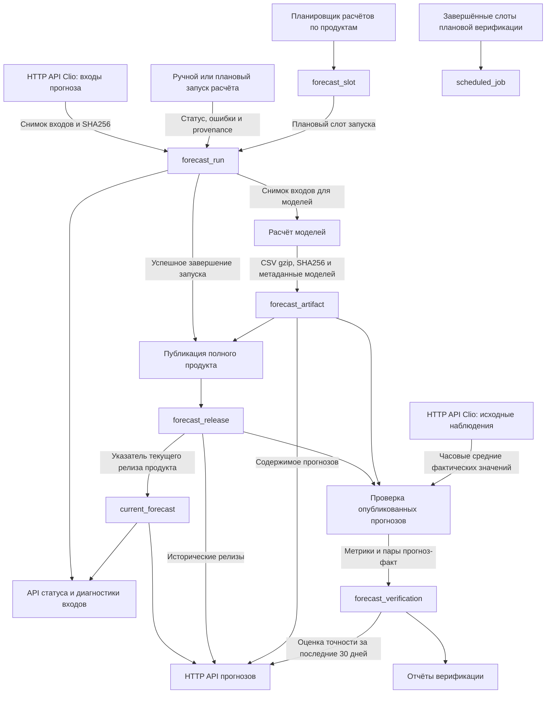

## Data flows

```mermaid
flowchart TD
    clio[HTTP API Clio: входы прогноза] -->|Снимок входов и SHA256| forecast_run
    generation[Ручной или плановый запуск расчёта] -->|Статус, ошибки и provenance| forecast_run
    scheduler[Планировщик расчётов по продуктам] --> forecast_slot
    forecast_slot -->|Плановый слот запуска| forecast_run
    forecast_run -->|Снимок входов для моделей| models[Расчёт моделей]
    models -->|CSV gzip, SHA256 и метаданные моделей| forecast_artifact
    forecast_run -->|Успешное завершение запуска| publication[Публикация полного продукта]
    forecast_artifact --> publication
    publication --> forecast_release
    forecast_release -->|Указатель текущего релиза продукта| current_forecast
    current_forecast --> api[HTTP API прогнозов]
    forecast_release -->|Исторические релизы| api
    forecast_artifact -->|Содержимое прогнозов| api
    forecast_run --> status[API статуса и диагностики входов]
    current_forecast --> status
    forecast_release --> verification[Проверка опубликованных прогнозов]
    forecast_artifact --> verification
    observations[HTTP API Clio: исходные наблюдения] -->|Часовые средние фактических значений| verification
    verification -->|Метрики и пары прогноз-факт| forecast_verification
    forecast_verification --> reports[Отчёты верификации]
    forecast_verification -->|Оценка точности за последние 30 дней| api
    jobs[Завершённые слоты плановой верификации] --> scheduled_job
```
