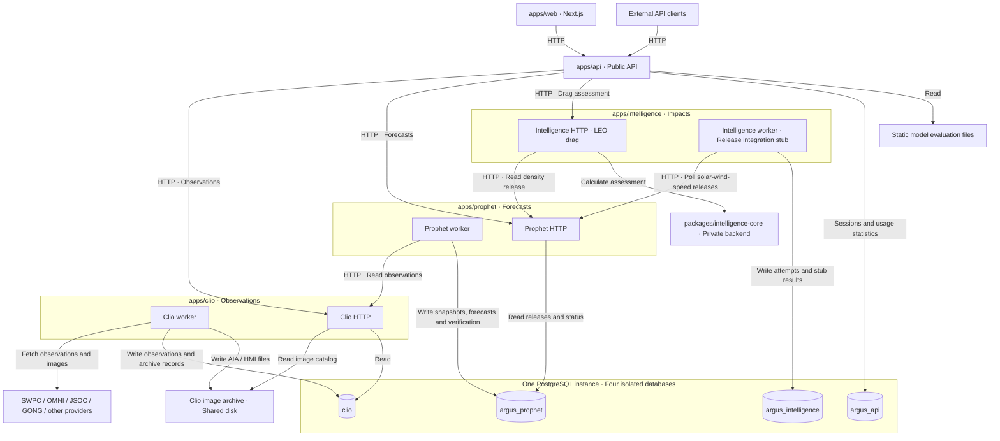
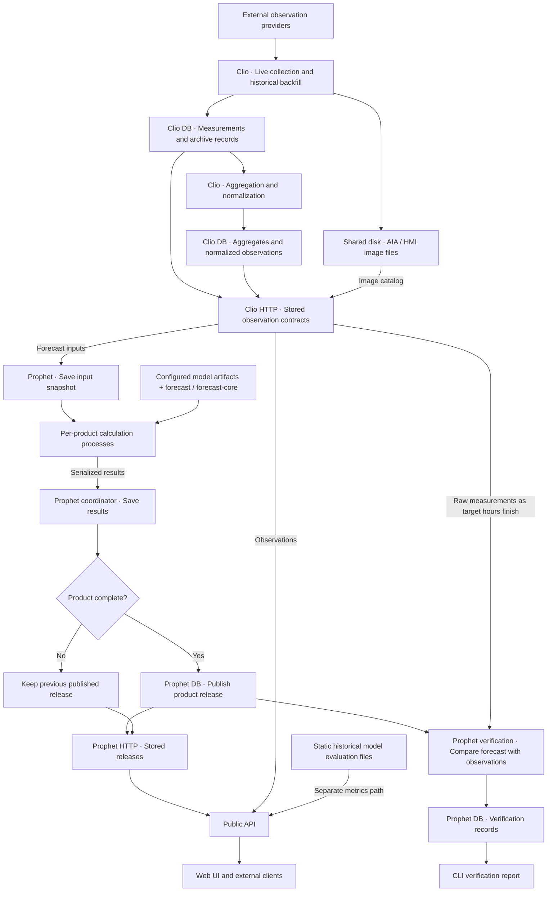

# Architecture

## Service map

Arrows show the direction of requests or storage access, not the direction of
response data. Internal service calls use HTTP; each service accesses only its
own database. Worker and HTTP processes are shown separately where their roles differ.

Intelligence's HTTP assessment path does not use its worker database. The worker
currently records integration stub results; it does not calculate drag assessments.
See the service READMEs for [Clio](../apps/clio/README.md),
[Prophet](../apps/prophet/README.md), [Intelligence](../apps/intelligence/README.md)
and the [public API](../apps/api/README.md).

## Observation and forecast data flow

Here arrows show **data movement**. Collection, generation and verification run
on their own schedules or through explicit commands. Public reads serve stored
observations and releases without triggering collection or forecast generation.

Products publish independently. Failed calculations leave the previous release
available; calculation processes receive saved inputs and do not write to the
database. Verification evaluates existing releases as observations arrive, retains
pending or missing targets, and does not update the static website model metrics.
The shared SDO collector stores AIA/HMI images and native AIA193 originals for
45 days; there is no separate AIA193 collector. Clio owns the full source history;
Prophet's feature cache is disposable. New GONG originals also live on disk.
Clio's database stores GONG file
receipts; existing compressed GONG originals remain readable during migration.
Clio's SDO endpoint returns file references and metadata; the original-file endpoint
serves checksum-verified AIA/GONG/GOES files to Prophet.
See [forecast workflows](forecast-workflows.md) for the verification protocol.

These diagrams describe runtime boundaries and data flow; the tables below map
them to repository packages and database ownership. Update the diagrams when
service contracts, storage ownership or publication paths change.

## Services and packages

| Component | Responsibility |
| --- | --- |
| `apps/api` | Public HTTP, dashboard authentication and API statistics; reads Clio, Prophet and Intelligence over HTTP |
| `apps/clio` | Observation collection, storage, aggregation, scheduling and internal reads |
| `apps/prophet` | Forecast generation, input snapshots, releases and scheduling |
| `apps/intelligence` | Consumes Prophet releases; serves on-demand LEO drag assessments and records worker stub results |
| `apps/web` | Next.js frontend |
| `packages/common` | Configuration and shared contracts |
| `apps/clio/src/clio/providers` | Public provider fetching and parsing, owned by Clio |
| `packages/forecast` | Public solar-wind inference, features and shared calculation primitives |
| `packages/forecast-core` | Private non-solar-wind models, training and calibration; uses the public forecast library |
| `packages/intelligence-core` | Proprietary impact calculations; separate private repository |

Data flows from providers through Clio → Prophet → Intelligence. API reads Clio, Prophet and Intelligence contracts. Reads never collect data or generate forecasts. Forecast
artifacts are stored in PostgreSQL; model evaluation metrics are static files.
Prophet publishes each product independently and retries only failed products
within each product’s current schedule slot. It does not export forecast files.

Clio deploys as HTTP plus one worker container. One scheduler dispatches temporary
executors with independent live lanes and bounded background concurrency. It
retains task locks until executors exit, so normalization cannot block collection.

Clio downloads, parses and archives source observations without forecast packages,
feature extraction or model calibration. Prophet downloads checksum-verified originals
through Clio's authenticated file API, derives AIA/GONG features, and calibrates GOES
solar indices before saving its input snapshot. Prophet installs the `[models]`
extra of `forecast-core` and owns its local derivative cache.
API installs without private code; Intelligence depends on `intelligence-core`
and uses its `api` boundary for on-demand drag calculations. Neither imports
other applications' runtimes. `intelligence-api` reads the density release over
HTTP and needs no database credentials; the existing worker remains a separate
release-integration process.

## Database ownership

One PostgreSQL instance hosts four independent databases. Each service and its
Alembic migrations share one database owner. Provisioning revokes public database
access; cross-service reads use HTTP. Resources and server availability remain shared.

| Service | Suggested database / owner | Schema | Migrations |
| --- | --- | --- | --- |
| API | `argus_api` | `api` | `apps/api/alembic` |
| Clio | `clio` | `clio` | `apps/clio/src/clio/migrations` |
| Prophet | `argus_prophet` | `prophet` | `apps/prophet/src/argus_prophet/migrations` |
| Intelligence | `argus_intelligence` | `intelligence` | `apps/intelligence/src/argus_intelligence/migrations` |

Each application receives only its own prefixed database credentials. Session
advisory locks serialize supported writers; Prophet and Intelligence reuse the
lock connection for writes and require direct or session-pooled PostgreSQL.

## Dependencies and configuration

Python dependency boundaries (distinct from HTTP service calls):

| Consumer | Internal package dependencies |
| --- | --- |
| `forecast` | `common` only |
| Clio | `common` only; no forecast packages |
| API | `common` only; calls Prophet and Intelligence over HTTP without installing them |
| Intelligence | `common`, private `intelligence-core`; calls Prophet over HTTP |
| `forecast-core` | `forecast`, `common` |
| Prophet | `forecast`, `forecast-core`, `common` |

Only Clio imports its `clio.providers` modules. Other services
receive observations over HTTP. Clio owns archive loading and caching; the private
backend exposes calibration computations over supplied data. Libraries must not depend on
application runtimes. Architecture tests check imports, declared dependencies
(including extras), and the API lockfile; private manifest checks run when its
checkout is available.

All packages live in `packages/`. Proprietary `forecast-core` and
`intelligence-core` are excluded from the public Git repository and maintained
in separate repositories. Both backend repositories remain private; numerical impact implementation and
its documentation belong in `intelligence-core`.
The public Python workspace resolves without private repositories. Solar-wind
speed and density inference run entirely in `forecast`, including feature building
and quantile blending. The private backend depends on that public library; the
public library never imports private code. Prophet's product catalog resolves
public and private adapters lazily, without a second model enumeration.
See the [public package example and tests](../packages/forecast/README.md).
`packages/forecast-core` is an ignored, separate Git checkout required by Prophet
builds. Keep its version consistent with the Prophet lockfile;
push private changes before deploying dependent public code. CI pins the private
commit used by the Prophet image. Do not publish private implementation or training code.

Configuration uses `ARGUS_WORKDIR`, or searches the current directory and parents
for `configs/project.yaml`. The command adapters set the workdir and load root env
files. See [local setup](../README_DEPLOY.md#local-development),
[commands](commands.md) and [deployment](../README_DEPLOY.md).

## Validation

`./scripts/test-python -q` runs the application, public package and private backend
and training suites. Private tests require the private checkout and installed dependencies.
Repository-wide architecture, deployment, CLI wrapper and cross-service tests live
in `tests/`. Application tests, including their integration scenarios, live in
`apps/<app>/tests/`; package tests live in `packages/<package>/tests/` and training
tests in `scripts/training/tests/`. Shared disposable-database helpers live in
`tests/support/`. Database URL contracts for all four services are tested once in
`tests/test_database_urls.py`.

For domain integration, run `./scripts/test-domain-storage` with uv, Docker and
both private checkouts available. This is the exact entry point used in CI and
before deployment. It creates and removes a disposable PostgreSQL 17 container,
checks service imports and migrations first, then runs all domain integration
checks. An explicit `TEST_DATABASE_ADMIN_DSN` can instead select an existing
**disposable** PostgreSQL server with database/role administration rights.
The runner uses temporary configuration and disables Sentry; it does not load
local `.env` credentials.

`tests/runtime` contains only tools for project-wide checks (pytest, YAML/packaging
and database administration). It does not install any application or model package.
`./scripts/test-python` and the pytest stages of `./scripts/test-domain-storage`
use eight pytest-xdist workers per suite. Pass `-n 0` for a sequential run or
`-n N` to change the worker count. Project-wide checks are included in
`./scripts/test-python`. PostgreSQL integration checks
still require `TEST_DATABASE_ADMIN_DSN` or the dedicated domain-storage runner.
Each application's tests run in `apps/<app>/.venv`, synchronized from its own lock
with the `test` dependency group. The runner removes inherited `PYTHONPATH` and
`UV_PROJECT_ENVIRONMENT`; installed packages must supply all application imports.
High-level migration checks launch the Python interpreter belonging to each service.

Package suites use their own `packages/<package>/.venv` and `test` dependency
group; training tests use `scripts/training/.venv`.
PyTorch belongs to the forecast-core test environment only. Training tests explicitly
install the ingestion and calibration dependencies exercised by their pipeline checks.
Update the lock of the owner whose dependencies changed with `uv lock --project <path>`.
All runners use `--locked`; no shared service dependency set is assembled for tests.
The Python script synchronizes each owner's environment and runs its tests
one owner at a time, with eight workers within each suite, stopping on the first failure.
Without `TEST_DATABASE_ADMIN_DSN`, database modules are reported as skipped (`-rs`); execute
`./scripts/test-domain-storage` to run them against a disposable PostgreSQL server.

Web tests use eight workers by default: `pnpm --filter web test:dashboard` for
Playwright and `pnpm --filter web test` for Node tests. Playwright accepts
`--workers=1` for sequential debugging or `--workers=N` to change concurrency.

Public boundary checks run without private credentials. Domain integration uses
private checkouts and therefore skips fork and Dependabot pull requests; it runs
on same-repository pull requests targeting `master`. Deployment always runs it
with the exact private commits selected for the release and waits for success.

Boundary tests check import direction, private adapters, absence of foreign-domain
SQL and isolated credentials. Integration tests cover migrations, ownership,
publication and locking. See each service README for its runtime guarantees.

Prophet keeps exclusive writer sessions in its coordinator. Spawned per-product
calculations receive saved snapshots and explicit model configuration, then return
serialized results; they never inherit a database connection. All backends use
`forecast_snapshot`, including private IMF and atmospheric density; density snapshot
preparation belongs entirely to `forecast-core`. GONG inputs
are downloaded and archived as original FITS files by Clio. Prophet extracts
GONG features and includes them in its saved snapshots. Private
inference must not read project configuration or local observation files.

Prophet dispatches products on independent configurable schedules, with bounded
calculation concurrency and parent-owned generation writes. Verification uses a
separate process and writer lock; cleanup acquires both locks. Existing model
issue times and grids remain hourly even when execution schedules are more frequent.
