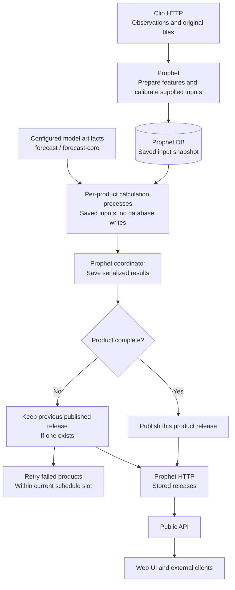

# Forecast publication

Arrows show data or processing progression. Products publish independently.
A failed attempt retains the previous release when one exists; it does not
create a synthetic fallback release. Calculation processes receive saved inputs;
the coordinator owns database writes. Public reads never trigger generation.

See [Prophet](../../../apps/prophet/README.md) and the
[architecture overview](../README.md).
