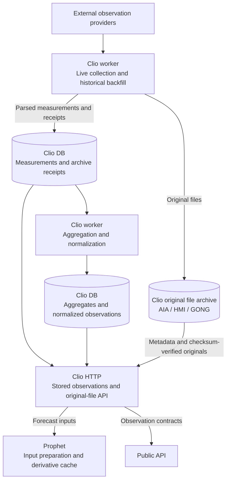

# Observation collection and preparation

Arrows show data movement. Clio owns source history and original-file receipts.
Prophet derives model features from downloaded originals and owns a disposable
derivative cache. Public reads do not trigger collection or preparation.

See [Clio](../../../apps/clio/README.md),
[Prophet](../../../apps/prophet/README.md) and the
[architecture overview](../README.md).
