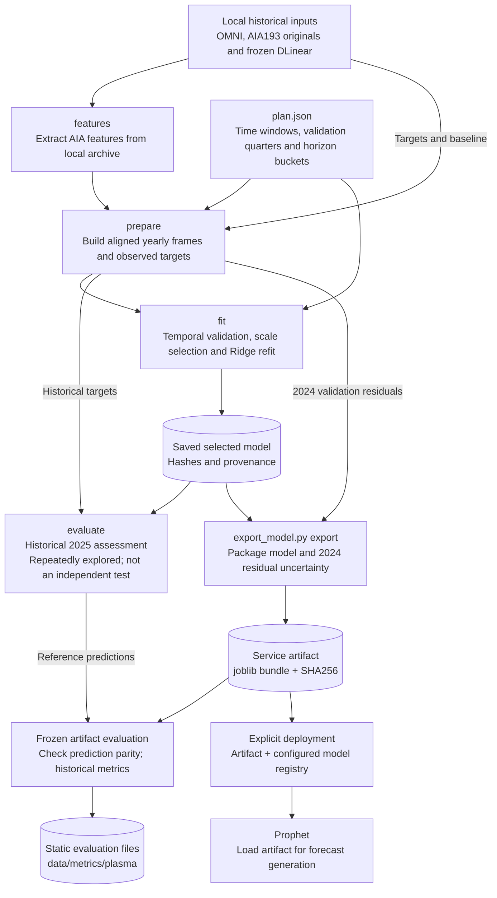

# Training and artifact delivery

This diagram documents the supported **public AIA/Ridge solar-wind training
pipeline**, not a claim that every model uses the same training steps. Arrows
show data or processing progression. Commands and provenance checks are described
in the [training README](../../../scripts/training/aia_wind/README.md).

`features`, `prepare`, `fit` and `evaluate` are explicit commands; evaluation does
not silently retrain a stale model. The service exporter packages the selected
model and validation residual uncertainty, checks prediction parity and writes
historical metrics. Deployment of the artifact is a separate action.

The 2025 period has been repeatedly explored and is not an independent test.
Optional model evaluation and MLflow logging in local notebooks are separate
from this public command pipeline. Private training implementations remain in
their respective private repositories.

See [operational verification](verification.md) for evaluation of published
releases and the [architecture overview](../README.md).
