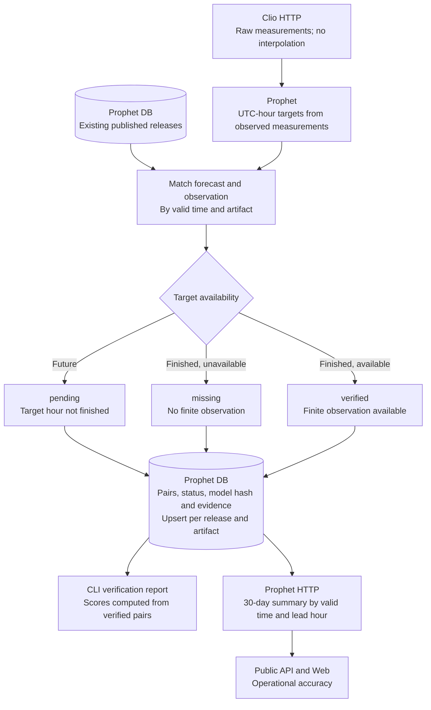

# Operational verification

Verification uses raw observations as target hours finish. Missing and pending
targets remain explicit. Scores use verified pairs and are grouped by artifact,
model hash and horizon. This process does not update static historical metrics.
Arrows show data or processing progression.

See the [verification protocol](../../forecast-workflows.md) and the
[architecture overview](../README.md).
