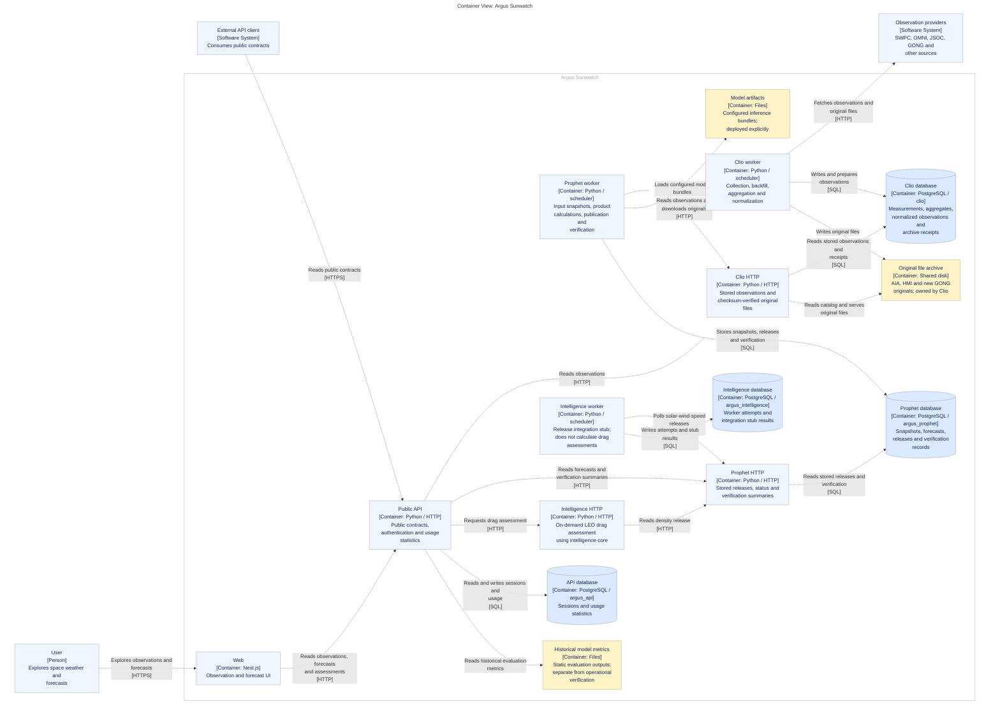

# Containers

Generated from [workspace.dsl](../../workspace.dsl). Do not edit by hand.

Arrows show requests or storage access, not response data.

```mermaid
graph TB
  linkStyle default fill:#ffffff

  subgraph diagram ["Container View: Argus Sunwatch"]
    style diagram fill:#ffffff,stroke:#ffffff

    1["User<br/>[Person]<br/>Explores space weather and<br />forecasts"]
    style 1 fill:#eff6ff,stroke:#a7acb2,color:#172554
    2["External API client<br/>[Software System]<br/>Consumes public contracts"]
    style 2 fill:#eff6ff,stroke:#a7acb2,color:#172554
    3["Observation providers<br/>[Software System]<br/>SWPC, OMNI, JSOC, GONG and<br />other sources"]
    style 3 fill:#eff6ff,stroke:#a7acb2,color:#172554

    subgraph 4 ["Argus Sunwatch"]
      style 4 fill:#ffffff,stroke:#a7acb2,color:#a7acb2

      10["Prophet worker<br/>[Container: Python / scheduler]<br/>Input snapshots, product<br />calculations, publication and<br />verification"]
      style 10 fill:#eff6ff,stroke:#a7acb2,color:#172554
      11["Intelligence HTTP<br/>[Container: Python / HTTP]<br/>On-demand LEO drag assessment<br />using intelligence-core"]
      style 11 fill:#eff6ff,stroke:#a7acb2,color:#172554
      12["Intelligence worker<br/>[Container: Python / scheduler]<br/>Release integration stub;<br />does not calculate drag<br />assessments"]
      style 12 fill:#eff6ff,stroke:#a7acb2,color:#172554
      13[("API database<br/>[Container: PostgreSQL / argus_api]<br/>Sessions and usage statistics")]
      style 13 fill:#dbeafe,stroke:#99a3b1,color:#172554
      14[("Clio database<br/>[Container: PostgreSQL / clio]<br/>Measurements, aggregates,<br />normalized observations and<br />archive receipts")]
      style 14 fill:#dbeafe,stroke:#99a3b1,color:#172554
      15[("Prophet database<br/>[Container: PostgreSQL / argus_prophet]<br/>Snapshots, forecasts,<br />releases and verification<br />records")]
      style 15 fill:#dbeafe,stroke:#99a3b1,color:#172554
      16[("Intelligence database<br/>[Container: PostgreSQL / argus_intelligence]<br/>Worker attempts and<br />integration stub results")]
      style 16 fill:#dbeafe,stroke:#99a3b1,color:#172554
      17["Original file archive<br/>[Container: Shared disk]<br/>AIA, HMI and new GONG<br />originals; owned by Clio"]
      style 17 fill:#fef3c7,stroke:#b1aa8b,color:#172554
      18["Model artifacts<br/>[Container: Files]<br/>Configured inference bundles;<br />deployed explicitly"]
      style 18 fill:#fef3c7,stroke:#b1aa8b,color:#172554
      19["Historical model metrics<br/>[Container: Files]<br/>Static evaluation outputs;<br />separate from operational<br />verification"]
      style 19 fill:#fef3c7,stroke:#b1aa8b,color:#172554
      5["Web<br/>[Container: Next.js]<br/>Observation and forecast UI"]
      style 5 fill:#eff6ff,stroke:#a7acb2,color:#172554
      6["Public API<br/>[Container: Python / HTTP]<br/>Public contracts,<br />authentication and usage<br />statistics"]
      style 6 fill:#eff6ff,stroke:#a7acb2,color:#172554
      7["Clio HTTP<br/>[Container: Python / HTTP]<br/>Stored observations and<br />checksum-verified original<br />files"]
      style 7 fill:#eff6ff,stroke:#a7acb2,color:#172554
      8["Clio worker<br/>[Container: Python / scheduler]<br/>Collection, backfill,<br />aggregation and normalization"]
      style 8 fill:#eff6ff,stroke:#a7acb2,color:#172554
      9["Prophet HTTP<br/>[Container: Python / HTTP]<br/>Stored releases, status and<br />verification summaries"]
      style 9 fill:#eff6ff,stroke:#a7acb2,color:#172554
    end

    1-. "Explores observations and<br />forecasts<br/>[HTTPS]" .->5
    2-. "Reads public contracts<br/>[HTTPS]" .->6
    5-. "Reads observations, forecasts<br />and assessments<br/>[HTTP]" .->6
    6-. "Reads observations<br/>[HTTP]" .->7
    6-. "Reads forecasts and<br />verification summaries<br/>[HTTP]" .->9
    6-. "Requests drag assessment<br/>[HTTP]" .->11
    6-. "Reads and writes sessions and<br />usage<br/>[SQL]" .->13
    6-. "Reads historical evaluation<br />metrics<br/>" .->19
    8-. "Fetches observations and<br />original files<br/>[HTTP]" .->3
    8-. "Writes and prepares<br />observations<br/>[SQL]" .->14
    8-. "Writes original files<br/>" .->17
    7-. "Reads stored observations and<br />receipts<br/>[SQL]" .->14
    7-. "Reads catalog and serves<br />original files<br/>" .->17
    10-. "Reads observations and<br />downloads originals<br/>[HTTP]" .->7
    10-. "Loads configured model<br />bundles<br/>" .->18
    10-. "Stores snapshots, releases<br />and verification<br/>[SQL]" .->15
    9-. "Reads stored releases and<br />verification<br/>[SQL]" .->15
    11-. "Reads density release<br/>[HTTP]" .->9
    12-. "Polls solar-wind-speed<br />releases<br/>[HTTP]" .->9
    12-. "Writes attempts and stub<br />results<br/>[SQL]" .->16

  end
```

[Architecture overview](../../README.md)
